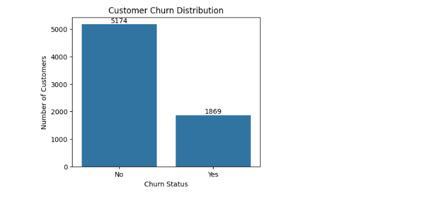
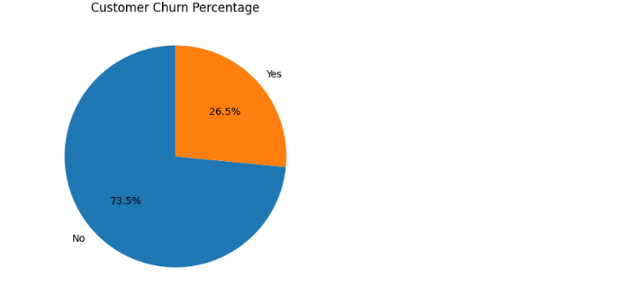
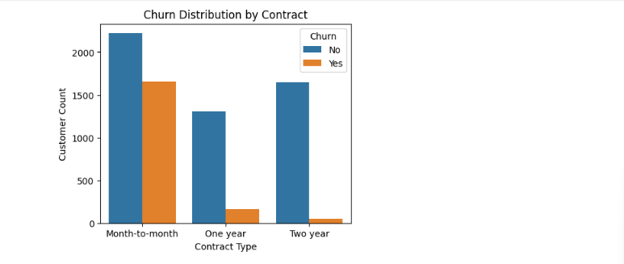
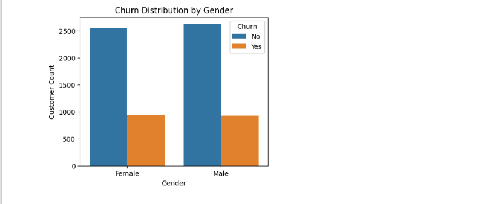
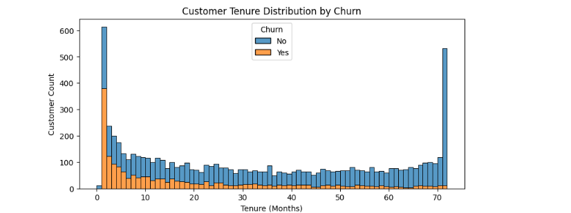
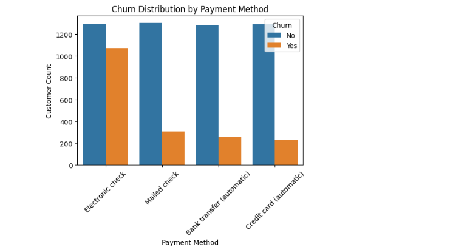

# Telco Customer Churn Analysis

This project analyzes customer churn behavior in a telecom company using a dataset of 7,043 customers and 21 features. The goal is to identify factors contributing to churn and provide actionable insights to improve customer retention.

---

## Tools & Technologies
- Python, Pandas, Matplotlib, Seaborn, Jupyter Notebook

---

## Dataset Overview
Contains customer information such as:

- **Demographics:** Gender, Senior Citizen  
- **Account info:** Tenure, Contract Type, Payment Method  
- **Services subscribed:** Internet Service, Online Security, Tech Support, etc.  
- **Churn status**  

**Total Records:** 7,043

---

## Key Findings & Insights

- **Churn Distribution:** 26.5% churned, 73.5% retained  
  
 

- **Contract Type:** Month-to-month contracts have the highest churn  

- **Gender:** Churn is similar across male and female customers  

- **Tenure:** Short-tenure customers are more likely to churn  
 

- **Payment Method:** Electronic check payments are associated with higher churn  
 

- Customers without value-added services (Online Security, Tech Support) are more likely to churn  

---

## Business Recommendations

- Encourage customers to switch to long-term contracts  
- Promote value-added services like Online Security and Tech Support  
- Offer retention incentives for new customers during early tenure  
- Encourage automatic payment methods

---

## Conclusion

By focusing on tenure, contract types, additional services, and payment methods, telecom companies can implement targeted strategies to reduce churn and improve customer satisfaction.
